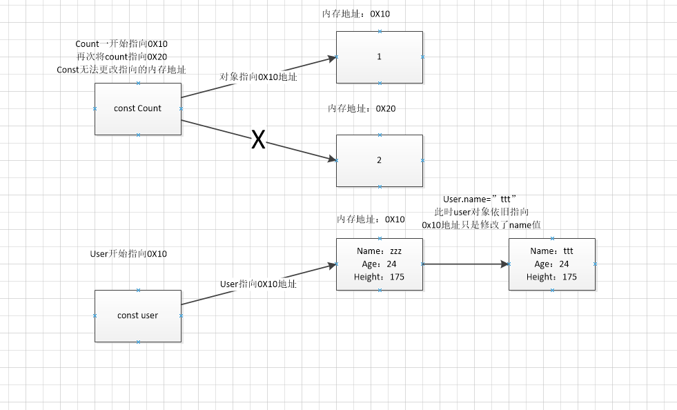

# （一）ES6补充

## 1.1块级作用域

​	ES6之前没有块级作用域，ES5的var没有块级作用域的概念，只有function有作用域的概念，ES6的let、const引入了块级作用域。

​	ES5之前if和for都没有作用域，所以很多时候需要使用function的作用域，比如闭包。

### 1.1.1	什么是变量作用域

​	变量在什么范围内可用，类似Java的全局变量和局部变量的概念，全局变量，全局都可用，局部变量只在范围内可用。ES5之前的var是没有块级作用域的概念，使用var声明的变量就是全局的。

```js
{
	var name = 'zzz';
	console.log(name);
}
console.log(name);
```

​	上述代码中{}外的`console.log(name)`可以获取到name值并打印出来，用var声明赋值的变量是全局变量，没有块级作用域。

### 1.1.2	没有块级作用域造成的问题

#### 	if块级

```javascript
var func;
if(true){
	var name = 'zzz';
	func = function (){
		console.log(name);
	}
	func();
}
name = 'ttt';
func();
console.log(name);
```

​	代码输出结果为`'zzz','ttt','ttt'`，第一次调用func()，此时name=‘zzz’，在if块外将name置成‘ttt’，此时生效了，if没有块级作用域。

#### for块级

​	定义五个按钮，增加事件，点击哪个按钮打印“第哪个按钮被点击了”。

```html
<!DOCTYPE html>
<html lang="en">
<head>
  <meta charset="UTF-8">
  <meta name="viewport" content="width=device-width, initial-scale=1.0">
  <meta http-equiv="X-UA-Compatible" content="ie=edge">
  <title>块级作用域</title>
</head>
<body>
  <button>按钮1</button>
  <button>按钮2</button>
  <button>按钮3</button>
  <button>按钮4</button>
  <button>按钮5</button>
  <script src="https://cdn.jsdelivr.net/npm/vue@2.6.10/dist/vue.js">    </script>
    <script>
      // 3.没有块级作用域引起的问题:for块级
      var btns = document.getElementsByTagName("button");
      for (var i = 0; i < btns.length; i++) {
        btns[i].addEventListener('click',function (param) {
        console.log("第"+i+"个按钮被点击了");
        });
      }
    </script>
</body>
</html>
```

​	for块级中使用`var`声明变量i时，是全局变量，点击任意按钮结果都是“第五个按钮被点击了”。说明在执行`btns[i].addEventListener('click',function())`时，for块级循环已经走完，此时`i=5`，所有添加的事件的i都是5。

​	改造上述代码，将for循环改造，由于函数有作用域，使用闭包能解决上述问题。

```javascript
      // 使用闭包,函数有作用域
      for (var i = 0; i < btns.length; i++) {
        (function (i) {
          btns[i].addEventListener('click',function (param) {
            console.log("第"+i+"个按钮被点击了");
          })
        })(i);
      }
```

​	结果如图所示，借用函数的作用域解决块级作用域的问题，因为有块级作用域，每次添加的i都是当前i。


​	在ES6中使用let/const解决块级作用域问题，let和const有块级作用域，const定义常量，在for块级中使用let解决块级作用域问题。

```javascript
// ES6使用let/const
const btns = document.getElementsByTagName("button");
for (let i = 0; i < btns.length; i++) {
    btns[i].addEventListener('click',function (param) {
        console.log("第"+i+"个按钮被点击了");
    })
}
```

​	结果和使用闭包解决一致。

## 1.2	const的使用

​	1.const用来定义常量，赋值知乎不能再赋值，再次赋值会报错。

```javascript
<script>
    //1.定义常量，赋值后不能再赋值，在赋值报错
    const count = 1
// count = 2
</script>
```

​	2.const不能只声明不赋值，会报错。

```javascript
<script>
    //2.只声明不赋值，必须赋值
    // const count;
    </script>
```

​	3.const常量含义是你不能改变其指向的对象，例如user，都是你可以改变user属性。

```javascript
    <script>
        //3.常量的含义是你不能改变其指向的对象user，但是你可以改变user属性
        const user = {
            name:"zzz",
            age:24,
            height:175
        }
        console.log(user)
        user.name = "ttt"
        user.age = 22
        user.height = 188
        console.log(user)
    </script>
```

**const内存地址详解**



​	对象count一开始只想0x10的地址，直接将count（给count重新赋值，指向一个新的对象）指向地址改为0x20会报错，const是常量，无法更改对象地址。

​	对象user一开始指向0x10地址，user有`Name`、`Age`、`Height`三个属性，此时修改属性`Name='ttt'`，user对象的地址未改变，不会报错。

## 1.3	ES6的增强写法

### 1.3.1	ES6的对象属性增强型写法

​	ES6以前定义一个对象

```javascript
const name = "zzz";
const age = 18;
const user = {
  name:name,
  age:age
}
console.log(user);
```

​	ES6写法

```javascript
const name = "zzz";
const age = 18;
const user = {
	name,age
}
console.log(user);
```

### 1.3.2	ES6对象的函数增强型写法

​	ES6之前对象内定义函数

```javascript
const obj = {
  run:function(){
     console.log("奔跑");
  }
}
```

  ES6写法

```javascript
const obj = {
  run(){
     console.log("奔跑");
  }
}
```

## 1.4	箭头函数

### 1.4.1	认识箭头函数

> 传统定义函数的方式

```javascript
  const aaa = function (param) {
      
  }
```

> 对象字面量中定义函数

```javascript
const obj = {
    bbb (param) {  },
}
```

> ES6中的箭头函数

```javascript
//const ccc = (参数列表) => {}
  const ccc = () => {}
```

### 1.4.2	箭头函数的参数和返回值

#### 1.4.2.1	参数问题

> 1.放入两个参数

```javascript
const sum = (num1,num2) => {
    return num1 + num2 
}
```

> 2.放入一个参数,()可以省略

```javascript
const power = num => {
  return num * num
}
```

#### 1.4.2.2	函数内部

> 1.函数中代码块中有多行代码

```javascript
const test = () =>{
  console.log("hello zzz")
  console.log("hello vue")
}
```

> 2.函数代码块中只有一行代码，可以省略return

```javascript
// const mul = (num1,num2) => {
//   return num1 * num2
// }
const mul = (num1,num2) => num1* num2
// const log = () => {
//   console.log("log")
// }
const log = () => console.log("log")
```

### 1.4.3	箭头函数的this使用

> 什么时候使用箭头函数

```javascript
setTimeout(function () {
	console.log(this)
} , 1000);
setTimeout(() => {
	console.log(this)//这里this找的是window的this
}, 1000);
```

> 结论：箭头函数没有this，这里this引用的是最近作用域（aaa函数里的this）的this。

```javascript
const obj = {
    aaa(){
        setTimeout(function () {
            console.log(this)//window
        });
        setTimeout(() => {
            console.log(this)//obj
        });
    }
}
obj.aaa()
```

> ​	上述中第一个是window对象的this，第二个箭头函数的this是obj的。

```javascript
const obj = {
    aaa() {
        setTimeout(function () {
            setTimeout(function () {
                console.log(this) //window
            })
            setTimeout(() => {
                console.log(this) //window
            })
        })
        setTimeout(() => {
            setTimeout(function () {
                console.log(this) //window
            })
            setTimeout(() => {
                console.log(this) //obj
            })
        })
    }
}
obj.aaa()
```

## 高阶函数

### 1.5.1	filter过滤函数

```javascript
const nums = [2,3,5,1,77,55,100,200]
//要求获取nums中大于50的数
//回调函数会遍历nums中每一个数，传入回调函数，在回调函数中写判断逻辑，返回true则会被数组接收，false会被拒绝
let newNums = nums.filter(function (num) {
  if(num > 50){
    return true;
  }
  return false;
 })
 //可以使用箭头函数简写
//  let newNums = nums.filter(num => num >50)
```

### 1.5.2	map高阶函数

```javascript
// 要求将已经过滤的新数组每项乘以2
//map函数同样会遍历数组每一项，传入回调函数为参数，num是map遍历的每一项，回调函数function返回值会被添加到新数组中
let newNums2 = newNums.map(function (num) {
  return num * 2
 })
 //简写
//  let newNums2 = newNums.map(num => num * 2)
console.log(newNums2);
```

### 1.5.3	reduce高阶函数

```javascript
// 3.reduce高阶函数
//要求将newNums2的数组所有数累加
//reduce函数同样会遍历数组每一项，传入回调函数和‘0’为参数，0表示回调函数中preValue初始值为0，回调函数中参数preValue是每一次回调函数function返回的值，currentValue是当前值
//例如数组为[154, 110, 200, 400],则回调函数第一次返回值为0+154=154，第二次preValue为154，返回值为154+110=264，以此类推直到遍历完成
let newNum = newNums2.reduce(function (preValue,currentValue) {
  return preValue + currentValue
 },0)
//简写
// let newNum = newNums2.reduce((preValue,currentValue) => preValue + currentValue)
console.log(newNum);
```

### 1.5.4综合使用

```javascript
    //三个需求综合
    let n = nums.filter(num => num > 50).map(num => num * 2).reduce((preValue,currentValue) => preValue + currentValue)
    console.log(n);
```

