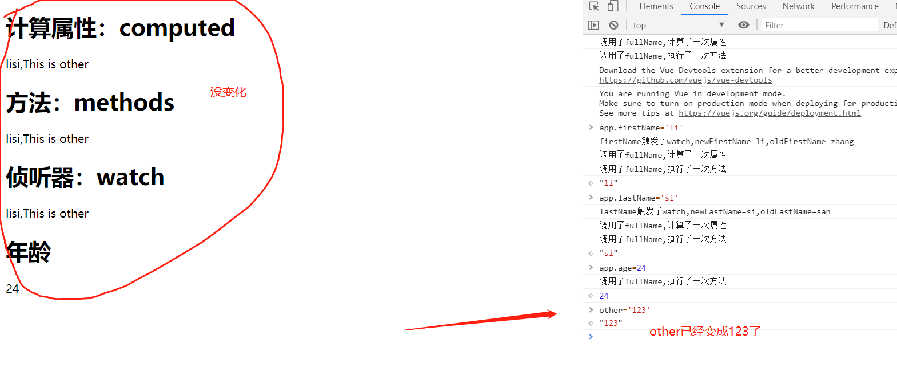
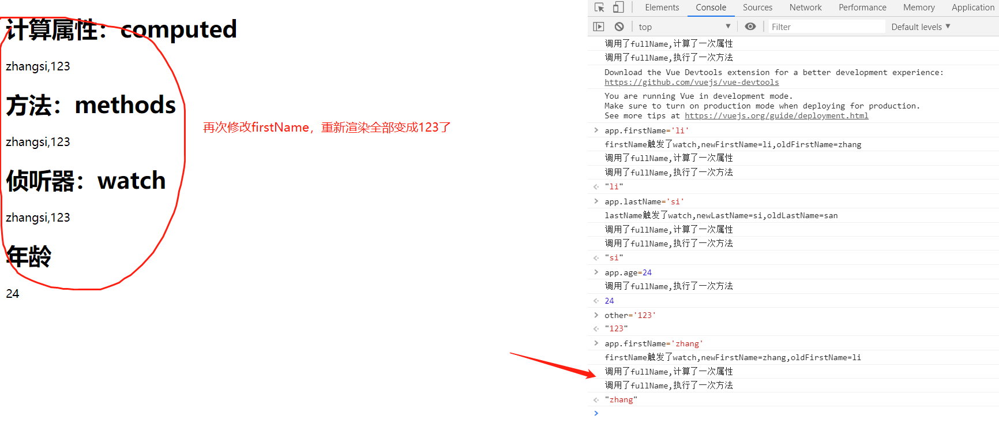

# （五）计算属性

## 5.1	计算属性的基本使用

​	现在有变量姓氏和名字，要得到完整的名字。

```html
<!DOCTYPE html>
<html lang="en">
<head>
  <meta charset="UTF-8">
  <meta name="viewport" content="width=device-width, initial-scale=1.0">
  <meta http-equiv="X-UA-Compatible" content="ie=edge">
  <title>计算属性的基本使用</title>
</head>
<body>
  <div id="app">
    <!-- Mastache语法 -->
    <h2>{{firstName+ " " + lastName}}</h2>
    <!-- 方法 -->
    <h2>{{getFullName()}}</h2>
    <!-- 计算属性 -->
    <h2>{{fullName}}</h2>
  </div>
  <script src="https://cdn.jsdelivr.net/npm/vue@2.6.10/dist/vue.js"></script>
  <script>
    const app = new Vue({
      el:"#app",
      data:{
        firstName:"skt t1",
        lastName:"faker"
      },
      computed: {
        fullName:function(){
          return this.firstName + " " + this.lastName
        }
      },
      methods: {
        getFullName(){
          return this.firstName + " " + this.lastName
        }
      },
    })
  </script>
</body>
</html>
```

1. 使用Mastache语法拼接`<h2>{{firstName+ " " + lastName}}</h2>`
2. 使用方法methods`<h2>{{getFullName()}}</h2>`
3. 使用计算属性computed`<h2>{{fullName}}</h2>`


> ​	例子中计算属性computed看起来和方法似乎一样，只是方法调用需要使用()，而计算属性不用，方法取名字一般是动词见名知义，而计算属性是属性是名词，但这只是基本使用。

## 5.2	计算属性的复杂使用

​	现在有一个数组数据books，里面包含许多book对象，数据结构如下：

```javascript
books:[
          {id:110,name:"JavaScript从入门到入土",price:119}, 
          {id:111,name:"Java从入门到放弃",price:80},
          {id:112,name:"编码艺术",price:99},
          {id:113,name:"代码大全",price:150},
        ]
```

​	要求计算出所有book的总价格`totalPrice`。

​	

```html
<!DOCTYPE html>
<html lang="en">
<head>
  <meta charset="UTF-8">
  <meta name="viewport" content="width=device-width, initial-scale=1.0">
  <meta http-equiv="X-UA-Compatible" content="ie=edge">
  <title>计算属性的复杂使用</title>
</head>
<body>
  <div id="app">


    <h2>总价格：{{totalPrice}}</h2>

  </div>
  <script src="https://cdn.jsdelivr.net/npm/vue@2.6.10/dist/vue.js"></script>
  <script>
    const app = new Vue({
      el:"#app",
      data:{
        books:[
          {id:110,name:"JavaScript从入门到入土",price:119},
          {id:111,name:"Java从入门到放弃",price:80},
          {id:112,name:"编码艺术",price:99},
          {id:113,name:"代码大全",price:150},
        ]
      },
      computed: {
        totalPrice(){
          let result= 0;
          for (let i = 0; i < this.books.length; i++) {
            result += this.books[i].price;
          }
          return result
        }
      }
    })
  </script>
</body>
</html>
```

​	获取每一个book对象的price累加，当其中一个book的价格发生改变时候，总价会随之变化。

## 5.3	计算属性的setter和getter

​	在计算属性中其实是由这样两个方法setter和getter。

```javascript
computed: {
    fullName:{
        //计算属性一般没有set方法，只读属性
        set:function(newValue){
            console.log("-----")
            const names = newValue.split(" ")
            this.firstName = names[0]
            this.lastName = names[1]
        },
            get:function(){
                return this.firstName + " " + this.lastName
            }
    }
}
```

​	但是计算属性一般没有set方法，只读属性，只有get方法，但是上述中newValue就是新的值，也可以使用set方法设置值，但是一般不用。

***computed的getter/setter***

> 请看如下代码：

```html
<!DOCTYPE html>
    <html lang="en">
    <head>
        <meta charset="UTF-8">
        <meta name="viewport" content="width=device-width, initial-scale=1.0">
        <meta http-equiv="X-UA-Compatible" content="ie=edge">
        <title>Vue计算属性的getter和setter</title>
        <script src="https://cdn.jsdelivr.net/npm/vue@2.6.10/dist/vue.js"></script>
    </head>
    <body>
        <div id="app">
            <h1>计算属性：computed的getter/setter</h1>
            <h2>fullName</h2>
            {{fullName}}
            <h2>firstName</h2>
            {{firstName}}
            <h2>lastName</h2>
            {{lastName}}
        </div>
        <script>
            var app = new Vue({
                el:"#app",
                data:{
                firstName:"zhang",
                lastName:"san",
                },
                computed: {
                    fullName:{
                        get:function(){
                            return this.firstName+" "+this.lastName
                        },
                        set:function(value){
                            var list = value.split(' ');
                            this.firstName=list[0]
                            this.lastName=list[1]
                        }
                    }
                },
            });
        </script>
    </body>
    </html>
```

> *初始化*


> 修改fullName*


> *结论*


\- 通过这种方式，我们可以在改变计算属性值的同时也改变和计算属性相关联的属性值。

## 5.4	计算属性和methods的对比

​	直接看代码，分别使用计算属性和方法获得fullName的值。

```html
<!DOCTYPE html>
<html lang="en">
<head>
  <meta charset="UTF-8">
  <meta name="viewport" content="width=device-width, initial-scale=1.0">
  <meta http-equiv="X-UA-Compatible" content="ie=edge">
  <title>计算属性和methods的对比</title>
</head>
<body>
  <div id="app">
    <!-- methods，即使firstName和lastName没有改变，也需要再次执行 -->
    <h2>{{getFullName}}</h2>
    <h2>{{getFullName}}</h2>
    <h2>{{getFullName}}</h2>
    <h2>{{getFullName}}</h2>
    <!-- 计算属性有缓存，只有关联属性改变才会再次计算 -->
    <h2>{{fullName}}</h2>
    <h2>{{fullName}}</h2>
    <h2>{{fullName}}</h2>
    <h2>{{fullName}}</h2>


  </div>
  <script src="https://cdn.jsdelivr.net/npm/vue@2.6.10/dist/vue.js"></script>
  <script>
    const app = new Vue({
      el:"#app",
      data:{
        firstName:"skt t1",
        lastName:"faker"
      },
      computed: {
        fullName(){
          console.log("调用了计算属性fullName");

          return this.firstName + " " + this.lastName
        }
      },
      methods: {
        getFullName(){
          console.log("调用了getFullName");

          return this.firstName + " " + this.lastName
        }
      },
    })
  </script>
</body>
</html>
```

​	分别使用方法和计算属性获取四次fullName，结果如图。


​	由此可见计算属性有缓存，在`this.firstName + " " + this.lastName`的属性不变的情况下，methods调用了四次，而计算属性才调用了一次，性能上计算属性明显比methods好。而且在改动firstName的情况下，计算属性只调用一次，methods依然要调用4次。


## 5.5	Vue计算属性与侦听器总结

> **照例看一段代码：**

```html
<!DOCTYPE html>
    <html lang="en">
    <head>
        <meta charset="UTF-8">
        <meta name="viewport" content="width=device-width, initial-scale=1.0">
        <meta http-equiv="X-UA-Compatible" content="ie=edge">
        <title>Vue计算属性/侦听器/方法比较</title>
        <script src="https://cdn.jsdelivr.net/npm/vue@2.6.10/dist/vue.js"></script>
    </head>
    <body>
        <div id="app">
            <h1>计算属性：computed</h1>
            {{fullName}}
            <h1>方法：methods</h1>
            {{fullName2()}}
            <h1>侦听器：watch</h1>
            {{watchFullName}}
            <h1>年龄</h1>
            {{age}}
        </div>
        <script>
            var other = 'This is other';
            var app = new Vue({
                el:"#app",
                data:{
                firstName:"zhang",
                lastName:"san",
                watchFullName:"zhangsan",
                age:18,
                },
                watch: {
                    firstName:function(newFirstName, oldFirstName){
                        console.log("firstName触发了watch,newFirstName="+newFirstName+",oldFirstName="+oldFirstName)
                        this.watchFullName = this.firstName+this.lastName+","+other
                    },
                    lastName:function(newLastName, oldLastName){
                        console.log("lastName触发了watch,newLastName="+newLastName+",oldLastName="+oldLastName)
                        this.watchFullName = this.firstName+this.lastName+","+other
                    }  
                },
                computed: {
                    fullName:function(){
                    console.log("调用了fullName,计算了一次属性")
                    return this.firstName+this.lastName+","+other;
                    }
                },
                methods: {
                    fullName2:function(){
                        console.log("调用了fullName,执行了一次方法")
                        fullName2 = this.firstName+this.lastName+","+other;
                        return fullName2;
                    }
                }
            });
        </script>
    </body>
    </html>
```

> 初始化：


> 修改firstName/lastName/两者都修改


> 修改computed中没计算的age


> 修改Vue实例外的对象



> 修改Vue实例外对象后在修改Vue实例内的对象



> 测试结论：

1. 使用computed计算了fullName属性，值为firstName+lastName。计算属性具有`缓存功能`，当firstName和lastName都不改变的时候，fullName不会重新计算，比如我们改变age的值，fullName的值是不需要重新计算的。
2. methods并没有缓存特性，比如我们改变age的值，fullName2()方法会被执行一遍。
3. 当一个功能可以用上面三个方法来实现的时候，明显使用computed更合适，代码简单也有缓存特性。
4. 计算属性范围在vue实例内，修改vue实例外部对象，不会重新计算渲染，但是如果先修改了vue实例外对象，在修改vue计算属性的对象，那么外部对象的值也会重新渲染。

> *计算属性：computed*

计算属性范围在Vue实例的fullName内所管理的firstName和lastName,通常监听多个变量


> *侦听器：watch*

监听数据变化，一般只监听一个变量或数组


> 使用场景

watch(`异步场景`)，computed(`数据联动`)

